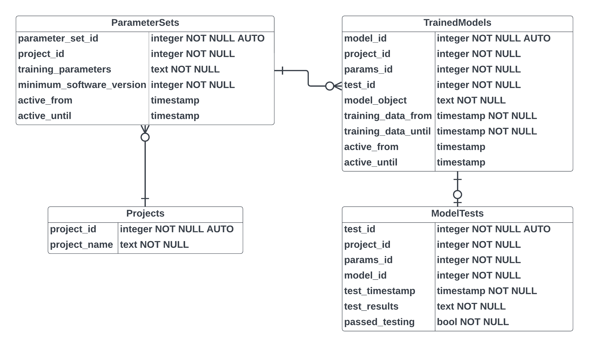

# Database Schema
The model management service stores all data in a PostgreSQL database.  The schema consists of four tables, corresponding to the four types of resources (projects, parameter sets, trained models, and model tests).

## Projects
All parameter sets, models, and test results are organized by project.  The Projects table stores an integer identifier (primary key) and name.

## Parameter Sets
Parameter sets are the configuration information needed to train a model on raw input data.

For example, in Scikit-Learn parlance, the parameter set would define any transformers (e.g., text vectorizers and scalers), the model class, and any parameters needed for instantiation.  It is assumed that a batch training job would pull all active parameter sets, train models for each, and upload those models through the service.

It should be noted that Scikit-Learn may not define all transformers needed; in that case, your model training and serving applications will need to define and share code for custom transformers.  The minimum software version property is used to ensure that the training and serving applications support the needed functionality.

Parameter sets support a date/time range over which its active.  There are three possible states, encoded as follows:

* Not active: `active_from` and `active_until` are both null.
* Active indefinitely: `active_from` has a date/time and `active_until` is null.
* Active for a definite interval: `active_from` and `active_until` both have date/times with `active_from < active_until`.

Any other states of the two date/times properties are invalid.

## Trained Models
Trained models are the serialized transformer and model parameters from training.

Through the `training_data_from` and `training_data_until` properties, the table records the date range of the data used in training.  It is assumed that a production system will train a model on data from some immediately previous time frame such as the previous 30 days.  This might be shifted (e.g., data from -30 to -2 days).

Similarly, it is assumed that models will be retrained on a regular basis (e.g., every day).  To effectively "version" the models, the table supports a training date/time.

Like the parameter sets, the trained models have a concept of an active time range encoded by `active_from` and `active_until`.  The semantics are the same as those for the parameter sets.

## Model Tests
It is assumed that most production systems will run sanity checks on trained models before deploying them to production.  For example, data for a subset of users might be excluded from training.  The model might then be tested on data for those excluded users.  Deployment of the model would be gated on passing the sanity checks.

The table stores the date/time of the test, the test results, and a flag indicating whether the evaluations met the user-defined criteria.

## Note on Object Serialization
JSON is used by the REST API to exchange data.  JSON does not support a binary or bytes type, so strings are used to store the serialized objects.  These values are stored directly in the database as text.  It might be better to store the serialized objects as binary strings in the database (e.g., using the bytea type).

